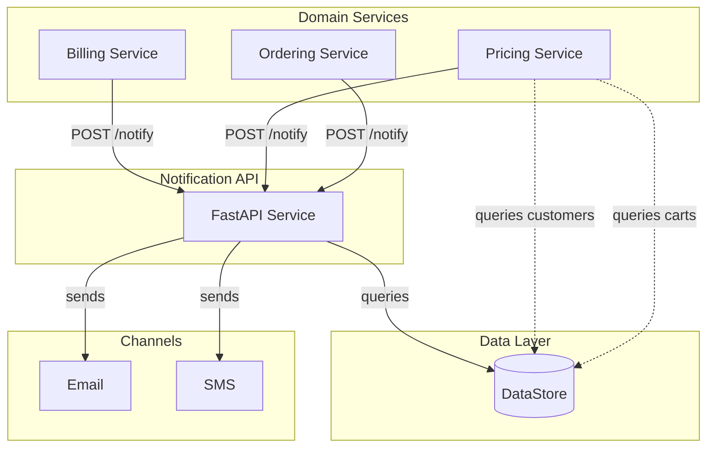

# API-Driven Notification Approach

This package implements the **API-driven architecture** for notifications.

## Overview

In this approach:
- Domain services **call the notification API** when they want to notify
- The calling service **decides WHEN** to send notifications
- The notification API handles **HOW** (templates, channels, delivery)

## Architecture



## Key Components

### Notification API (`notification_api.py`)
- FastAPI service with `/notify` and `/notify/bulk` endpoints
- Handles customer lookup, preferences, templating
- Stateless - all context provided in request

### API Models (`models.py`)
- `NotificationRequest` - What to send and to whom
- `NotificationResponse` - What was sent
- `BulkNotificationRequest` - Notify multiple customers

### Domain Services (`services/`)
- **OrderingService**: Ships orders, calls notification API
- **PricingService**: Updates prices, finds eligible customers, calls API
- **BillingService**: Processes payments, calls notification API

## Notification Scenarios

### Simple: Order Shipped
```
OrderingService.ship_order()
    → updates order status
    → builds notification context
    → calls POST /notify
    → API looks up customer, sends notification
```

### Medium: Payment Failed
```
BillingService.process_payment_failure()
    → records failure
    → calls POST /notify with failure reason
```

### Complex: Price Drop Alert ⚠️
```
PricingService.update_price()
    → updates price
    → queries carts (CROSS-DOMAIN!)
    → queries customers (CROSS-DOMAIN!)
    → queries preferences (CROSS-DOMAIN!)
    → checks eligibility rules
    → calls POST /notify for each eligible customer
```

### Complex: Order Complete ⚠️
```
OrderingService.ship_line_item()
    → updates item status
    → tracks shipment state INTERNALLY
    → when all shipped: calls POST /notify
```

## Benefits

1. **Explicit Control**
   - Clear when notifications are sent
   - Logic visible in calling service

2. **Simple Notification Service**
   - No event subscriptions
   - No event correlation
   - Just receives requests and sends

3. **Request/Response**
   - Immediate feedback on success/failure
   - Easier to debug individual calls

## Trade-offs ⚠️

1. **Cross-Domain Coupling**
   - PricingService must query carts, customers, preferences
   - Violates single responsibility

2. **Distributed Notification Logic**
   - "When to notify" spread across services
   - Hard to see all notification rules

3. **Duplicated Eligibility Rules**
   - Each service may implement similar rules
   - Risk of inconsistency

4. **State Management Burden**
   - OrderingService must track shipment state
   - Logic that could be centralized is distributed

## Complexity Comparison

| Aspect | Event-Sourced | API-Driven |
|--------|--------------|------------|
| PricingService queries carts | ❌ No | ✅ Yes (coupling!) |
| PricingService knows eligibility rules | ❌ No | ✅ Yes (coupling!) |
| OrderingService tracks shipment state | ❌ No | ✅ Yes (complexity!) |
| NotificationService has event correlation | ✅ Yes | ❌ No |

## API Endpoints

### POST /notify
Send a single notification.

```json
{
  "notification_type": "ORDER_SHIPPED",
  "customer_id": "cust-001",
  "context": {
    "order_id": "ord-001",
    "item_list": "..."
  }
}
```

### POST /notify/bulk
Send to multiple customers.

```json
{
  "notification_type": "PRICE_DROP_ALERT",
  "customer_ids": ["cust-001", "cust-002"],
  "context": {
    "product_name": "Router X500",
    "old_price": 149.99,
    "new_price": 119.99
  }
}
```

## Usage

```python
from api_driven.notification_api import NotificationAPI
from api_driven.services.ordering import OrderingService

# Set up
api = NotificationAPI()
ordering = OrderingService(notification_api=api)

# This calls the notification API directly
ordering.ship_order("ord-001")
```

## Running the Demo

```bash
uv run python -m api_driven.demo
```

Or individual scenarios:
```bash
uv run python -c "from api_driven.demo import run_order_shipped_demo; run_order_shipped_demo()"
uv run python -c "from api_driven.demo import run_price_drop_demo; run_price_drop_demo()"
uv run python -c "from api_driven.demo import run_order_complete_demo; run_order_complete_demo()"
```

## Running the API Server

```bash
uv run uvicorn api_driven.notification_api:app --reload
```

Then visit http://localhost:8000/docs for interactive API documentation.
