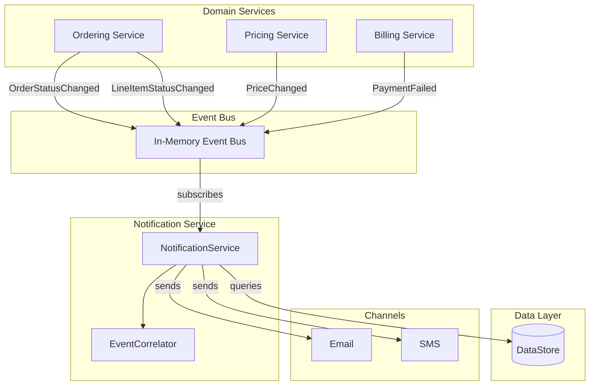

# Event-Sourced Notification Approach

This package implements the **event-sourced architecture** for notifications.

## Overview

In this approach:
- Domain services **publish events** when things happen
- The notification service **subscribes to events** and decides when/how to notify
- Services are **loosely coupled** via the event bus

## Architecture



## Key Components

### Event Bus (`event_bus.py`)
- In-memory pub/sub mechanism
- Supports typed subscriptions
- Logs all events for debugging

### Events (`events.py`)
- `OrderStatusChanged` - Order lifecycle events
- `LineItemStatusChanged` - Individual item shipments
- `PriceChanged` - Product price changes
- `PaymentFailed` - Payment failures

### Notification Service (`notification_service.py`)
- Subscribes to all relevant events
- Contains ALL notification business logic
- Handles simple and complex scenarios
- Uses EventCorrelator for multi-event scenarios

### Event Correlator (`event_correlator.py`)
- Tracks state across multiple events
- Detects when all items in an order have shipped
- Triggers "Order Complete" notification

### Domain Services (`services/`)
- **OrderingService**: Publishes order/shipment events
- **PricingService**: Publishes price change events
- **BillingService**: Publishes payment events

## Notification Scenarios

### Simple: Order Shipped
```
OrderingService.ship_order()
    → publishes OrderStatusChanged event
    → NotificationService receives event
    → Looks up customer, preferences
    → Sends email/SMS
```

### Medium: Payment Failed
```
BillingService.process_payment_failure()
    → publishes PaymentFailed event
    → NotificationService receives event
    → Includes failure reason in notification
```

### Complex: Price Drop Alert
```
PricingService.update_price()
    → publishes PriceChanged event
    → NotificationService receives event
    → Queries carts for affected customers
    → Checks notification preferences
    → Checks segment eligibility
    → Sends to eligible customers only
```

### Complex: Order Complete
```
OrderingService.ship_line_item() [item 1]
    → publishes LineItemStatusChanged
    → EventCorrelator tracks: 1/2 items shipped

OrderingService.ship_line_item() [item 2]
    → publishes LineItemStatusChanged
    → EventCorrelator detects: 2/2 items shipped
    → Triggers "Order Complete" notification
```

## Benefits

1. **Loose Coupling**
   - Domain services don't know about notifications
   - Can add new subscribers without changing publishers

2. **Centralized Logic**
   - All notification rules in one place
   - Easy to understand and modify

3. **Single Responsibility**
   - PricingService just handles pricing
   - NotificationService handles all notification logic

4. **Event Replay**
   - Events are logged
   - Can replay for debugging

## Trade-offs

1. **Notification Service Complexity**
   - Must understand all event types
   - Complex scenarios require event correlation

2. **Event Schema Coupling**
   - Changes to events affect subscribers
   - Need versioning strategy

3. **Eventual Consistency**
   - Notifications are async to business operations
   - May need to handle out-of-order events

## Usage

```python
from event_sourced.event_bus import reset_event_bus
from event_sourced.notification_service import NotificationService
from event_sourced.services.ordering import OrderingService

# Set up
event_bus = reset_event_bus()
notification_service = NotificationService(event_bus=event_bus)
notification_service.start()

ordering_service = OrderingService(event_bus=event_bus)

# This automatically triggers notifications
ordering_service.ship_order("ord-001")

# Clean up
notification_service.stop()
```

## Running the Demo

```bash
uv run python -m event_sourced.demo
```

Or individual scenarios:
```bash
uv run python -c "from event_sourced.demo import run_order_shipped_demo; run_order_shipped_demo()"
uv run python -c "from event_sourced.demo import run_price_drop_demo; run_price_drop_demo()"
uv run python -c "from event_sourced.demo import run_order_complete_demo; run_order_complete_demo()"
```
