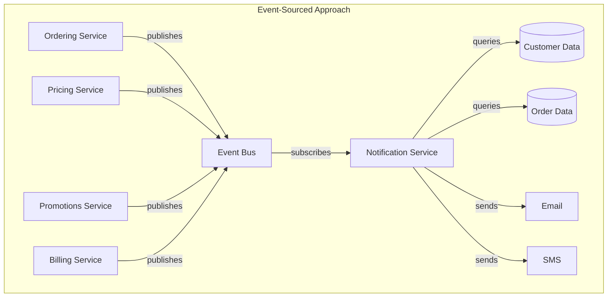
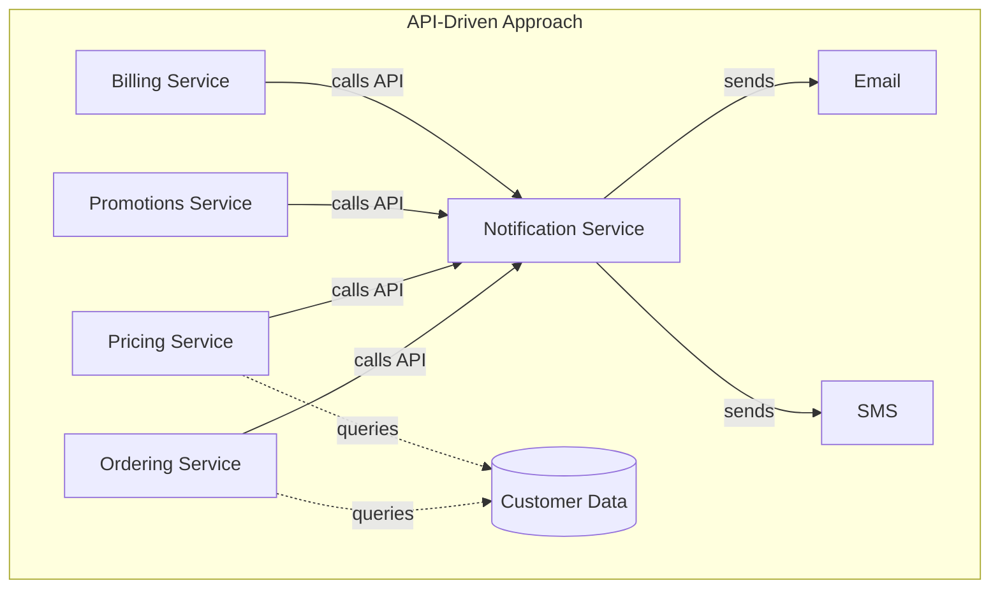

# Notification Service Architecture Comparison

## Original Prompt

> I want to create a demo project written in python. I want to demonstrate the value of two different design approaches and their tradeoffs.
>
> **Concept:** We need to drive a notification service logic for an e-commerce platform (use TMF as your inspiration). Consider the scenario to be that each of the primary domains of the BSS platform (catalog, cart, ordering, pricing, promotions, billing, payment, etc...) are owned and operated by different teams and organizations.
>
> **The two approaches we will be considering:**
>
> 1. **event-source** - Using this method, we will decouple events from logic to send notification. The events will be published by the disparate systems (ordering, pricing, promotions, billing, payment, etc...), and the logic to turn some of these events into notifications will be in a notification service that listens to these events.
>
> 2. **api-driven** - Using this method each of the systems will determine when to send the notification by calling a notification service API. But in this case, it will not do any additional logic to do such things as: look-up the contact, get the email, get the notification preference (send sms on this type of event) apply the message template, send to the desired preferred email or sms. All of that logic will be in the notification service.
>
> I want to carefully consider the pro's and con's of each of these design decisions. I want us to consider some contrived examples. In some cases, it's a simple logical determination to send a notification (e.g. an ordering milestone like equipment ordered). In some other cases, it will be much more complicated. I'm thinking of a scenario where multiple events need to have happened in order for a notification to be sent (like a price has been dropped, and only those accounts with the right eligibility should recieve a notification).

---

## Design Parameters (Clarified)

| Parameter             | Decision                                                            |
|-----------------------|---------------------------------------------------------------------|
| Services to simulate  | 5 domains: Ordering, Pricing, Promotions, Billing, Customer/Account |
| Event infrastructure  | In-memory event bus                                                 |
| Notification channels | Email and SMS                                                       |
| Delivery simulation   | Mock sending with logging                                           |
| Data persistence      | JSON files                                                          |
| Execution style       | Tests + runnable demo (FastAPI)                                     |
| Documentation         | Inline comments, separate docs per approach, mermaid diagrams       |
| Package management    | uv (all dependencies in pyproject.toml)                             |

---

## Notification Scenarios

We will implement the following scenarios to demonstrate varying complexity:

### Scenario 1: Simple - Order Shipped (Single Event)
**Trigger:** Order status changes to "SHIPPED"  
**Action:** Send notification to customer  
**Complexity:** Low - direct 1:1 event-to-notification mapping

### Scenario 2: Medium - Payment Failed (Single Event + Preference Logic)
**Trigger:** Payment attempt fails  
**Action:** Send notification via customer's preferred channel with retry instructions  
**Complexity:** Medium - requires customer preference lookup and templating

### Scenario 3: Complex - Price Drop Alert (Multi-condition)
**Trigger:** Price drops on a product  
**Conditions:**
- Customer has the product in their cart
- Customer has opted into "price alerts"
- Customer is in eligible segment (e.g., loyalty tier)

**Complexity:** High - requires correlation across multiple data domains

### Scenario 4: Complex - Order Complete (Event Aggregation)
**Trigger:** Multi-item order where items ship separately  
**Conditions:**
- All line items in the order have status "SHIPPED" or "DELIVERED"
- Only send ONE "Order Complete" notification when the last item ships

**Complexity:** High - requires tracking state across multiple events over time

---

## Architecture Overview

### High-Level Comparison





---

## Tradeoff Analysis Framework

We will evaluate each approach against these dimensions:

| Dimension                  | Event-Sourced                                   | API-Driven                                  |
|----------------------------|-------------------------------------------------|---------------------------------------------|
| **Coupling**               | Loose - services don't know about notifications | Tight - services must call notification API |
| **Logic Location**         | Centralized in notification service             | Distributed across services                 |
| **Event Schema Ownership** | Producers own schema, consumers adapt           | API contract is shared                      |
| **Complex Scenarios**      | Notification service correlates events          | Calling service must gather context         |
| **Debugging**              | Event replay possible                           | Request/response tracing                    |
| **New Notification Types** | Add subscriber logic                            | Modify calling service + API                |
| **Team Autonomy**          | High - publish events, done                     | Lower - must coordinate on when to call     |

---

## Project Structure

```
event-stream/
├── plan.md                          # This file
├── README.md                        # Project overview and quick start
├── pyproject.toml                   # Project configuration & dependencies (uv)
│
├── data/                            # JSON fixtures
│   ├── customers.json
│   ├── products.json
│   ├── orders.json
│   ├── carts.json
│   └── notification_preferences.json
│
├── shared/                          # Shared code between approaches
│   ├── __init__.py
│   ├── models.py                    # Domain models (Customer, Order, etc.)
│   ├── data_store.py                # JSON-backed data access
│   ├── channels.py                  # Email/SMS mock senders
│   └── templates.py                 # Notification templates
│
├── event_sourced/                   # Event-sourced approach
│   ├── __init__.py
│   ├── README.md                    # Approach-specific documentation
│   ├── event_bus.py                 # In-memory pub/sub
│   ├── events.py                    # Event definitions
│   ├── services/                    # Domain service simulators
│   │   ├── __init__.py
│   │   ├── ordering.py
│   │   ├── pricing.py
│   │   ├── promotions.py
│   │   └── billing.py
│   ├── notification_service.py      # Event subscriber + logic
│   ├── event_correlator.py          # Complex event processing
│   └── demo.py                      # Runnable demonstration
│
├── api_driven/                      # API-driven approach
│   ├── __init__.py
│   ├── README.md                    # Approach-specific documentation
│   ├── notification_api.py          # FastAPI notification service
│   ├── services/                    # Domain service simulators
│   │   ├── __init__.py
│   │   ├── ordering.py
│   │   ├── pricing.py
│   │   ├── promotions.py
│   │   └── billing.py
│   └── demo.py                      # Runnable demonstration
│
├── comparison/                      # Side-by-side analysis
│   ├── __init__.py
│   ├── run_scenarios.py             # Execute same scenarios both ways
│   └── analysis.md                  # Detailed comparison write-up
│
├── api/                             # Combined FastAPI application
│   ├── __init__.py
│   └── main.py                      # Unified API for demo
│
└── tests/
    ├── __init__.py
    ├── conftest.py                  # Shared fixtures
    ├── test_shared/
    │   ├── test_models.py
    │   └── test_data_store.py
    ├── test_event_sourced/
    │   ├── test_event_bus.py
    │   ├── test_simple_notification.py
    │   ├── test_price_drop_alert.py
    │   └── test_order_complete.py
    └── test_api_driven/
        ├── test_notification_api.py
        ├── test_simple_notification.py
        ├── test_price_drop_alert.py
        └── test_order_complete.py
```

---

## Implementation Phases

### Phase 1: Foundation (Shared Infrastructure)

**Objective:** Establish the core models, data layer, and notification infrastructure that both approaches will use.

**Deliverables:**
1. Project setup (pyproject.toml with all dependencies)
2. Domain models (Customer, Product, Order, Cart, LineItem)
3. JSON data fixtures with realistic test data
4. Data store abstraction for JSON file access
5. Mock email/SMS channels with logging
6. Notification templates

**Files to create:**
- `pyproject.toml`
- `shared/models.py`
- `shared/data_store.py`
- `shared/channels.py`
- `shared/templates.py`
- `data/*.json` (all fixtures)

**Verification:**
```bash
# 1. Sync dependencies (including dev tools like pytest)
uv sync --extra dev

# 2. Run all shared tests
uv run pytest tests/test_shared/ -v

# 3. Verify data loading
uv run python -c "from shared.data_store import DataStore; ds = DataStore(); print(f'Loaded {len(ds.get_customers())} customers, {len(ds.get_products())} products, {len(ds.get_orders())} orders')"

# 4. Verify channels work
uv run python -c "from shared.channels import EmailChannel, SMSChannel; EmailChannel().send('test@example.com', 'Test', 'Body'); SMSChannel().send('+1-555-1234', 'Order shipped!')"

# 5. Verify templates work
uv run python -c "from shared.templates import render_notification, NotificationType; subj, body = render_notification(NotificationType.PRICE_DROP_ALERT, 'email', customer_name='Alice', product_name='Router', old_price=149.99, new_price=119.99, savings=30.00, discount_percent=20); print(f'Subject: {subj}')"
```

**Expected output:**
- Tests: `72 passed`
- Data: `Loaded 5 customers, 6 products, 4 orders`
- Channels: `[EMAIL] To: test@example.com...` and `[SMS] To: +1-555-1234...`
- Templates: `Subject: Price Drop Alert: Router is now $119.99!`

---

### Phase 2: Event-Sourced Approach - Core

**Objective:** Implement the event bus and simple notification scenario.

**Deliverables:**
1. In-memory event bus with pub/sub
2. Event definitions (OrderStatusChanged, PaymentFailed, PriceChanged, etc.)
3. Notification service that subscribes to events
4. Simple scenario: Order Shipped notification

**Files to create:**
- `event_sourced/event_bus.py`
- `event_sourced/events.py`
- `event_sourced/notification_service.py`
- `event_sourced/services/ordering.py`

**Verification:**
```bash
# 1. Test event bus pub/sub
uv run pytest tests/test_event_sourced/test_event_bus.py -v

# 2. Test simple notification flow
uv run pytest tests/test_event_sourced/test_simple_notification.py -v

# 3. Manual verification
uv run python -c "
from event_sourced.demo import run_order_shipped_demo
run_order_shipped_demo()
"
# Should show: Event published, notification service received, email/sms sent
```

---

### Phase 3: Event-Sourced Approach - Complex Scenarios

**Objective:** Implement complex event correlation scenarios.

**Deliverables:**
1. Event correlator for multi-event scenarios
2. Price Drop Alert scenario (multi-condition)
3. Order Complete scenario (event aggregation)
4. Additional service simulators (pricing, promotions, billing)

**Files to create:**
- `event_sourced/event_correlator.py`
- `event_sourced/services/pricing.py`
- `event_sourced/services/promotions.py`
- `event_sourced/services/billing.py`

**Verification:**
```bash
# 1. Test price drop alert (complex conditions)
uv run pytest tests/test_event_sourced/test_price_drop_alert.py -v

# 2. Test order complete (event aggregation)
uv run pytest tests/test_event_sourced/test_order_complete.py -v

# 3. Manual verification of price drop
uv run python -c "
from event_sourced.demo import run_price_drop_demo
run_price_drop_demo()
"
# Should show: Only eligible customers notified

# 4. Manual verification of order complete
uv run python -c "
from event_sourced.demo import run_order_complete_demo
run_order_complete_demo()
"
# Should show: Notification only after ALL items shipped
```

---

### Phase 4: API-Driven Approach - Core

**Objective:** Implement the notification API and simple scenario.

**Deliverables:**
1. FastAPI notification service with endpoints
2. API models (NotificationRequest, NotificationResponse)
3. Service simulators that call the API
4. Simple scenario: Order Shipped notification

**Files to create:**
- `api_driven/notification_api.py`
- `api_driven/services/ordering.py`

**Verification:**
```bash
# 1. Test API endpoints
uv run pytest tests/test_api_driven/test_notification_api.py -v

# 2. Test simple notification via API
uv run pytest tests/test_api_driven/test_simple_notification.py -v

# 3. Start API and test manually
uv run uvicorn api_driven.notification_api:app --reload &
curl -X POST http://localhost:8000/notify \
  -H "Content-Type: application/json" \
  -d '{"notification_type": "ORDER_SHIPPED", "customer_id": "cust-001", "context": {"order_id": "ord-001"}}'
```

---

### Phase 5: API-Driven Approach - Complex Scenarios

**Objective:** Implement complex scenarios showing where logic must live.

**Deliverables:**
1. Price Drop Alert via API (shows distributed logic problem)
2. Order Complete via API (shows state tracking problem)
3. Additional service simulators

**Key insight to demonstrate:**
- For Price Drop Alert: Pricing service must query cart data and customer preferences
- For Order Complete: Ordering service must track shipment state

**Files to create:**
- `api_driven/services/pricing.py`
- `api_driven/services/promotions.py`
- `api_driven/services/billing.py`

**Verification:**
```bash
# 1. Test price drop alert via API
uv run pytest tests/test_api_driven/test_price_drop_alert.py -v

# 2. Test order complete via API
uv run pytest tests/test_api_driven/test_order_complete.py -v

# 3. Manual verification showing the complexity
uv run python -c "
from api_driven.demo import run_price_drop_demo
run_price_drop_demo()
"
# Should show: Pricing service had to query multiple data sources
```

---

### Phase 6: Documentation & Comparison

**Objective:** Create comprehensive documentation and side-by-side comparison.

**Deliverables:**
1. Event-sourced approach README with diagrams
2. API-driven approach README with diagrams
3. Comparison analysis document
4. Main project README

**Files to create:**
- `README.md`
- `event_sourced/README.md`
- `api_driven/README.md`
- `comparison/analysis.md`

**Verification:**
```bash
# 1. Run comparison script
uv run python comparison/run_scenarios.py

# 2. Review generated output
cat comparison/analysis.md

# 3. Verify all docs render (if you have markdown preview)
```

---

### Phase 7: Unified Demo Application

**Objective:** Create a single runnable application that demonstrates both approaches.

**Deliverables:**
1. Unified FastAPI application with both approaches
2. CLI interface for running scenarios
3. Web UI or API docs for interactive exploration

**Files to create:**
- `api/main.py`
- `cli.py` (optional command-line interface)

**Verification:**
```bash
# 1. Start the unified API
uv run uvicorn api.main:app --reload

# 2. Open API docs
open http://localhost:8000/docs

# 3. Run all scenarios via API
curl http://localhost:8000/demo/event-sourced/order-shipped
curl http://localhost:8000/demo/api-driven/order-shipped
curl http://localhost:8000/demo/comparison/price-drop-alert

# 4. Run full test suite with coverage
uv run pytest --cov=. --cov-report=html
open htmlcov/index.html
```

---

## Detailed Tradeoff Examples

### Example 1: Adding a New Notification Type

**Scenario:** Business wants to notify customers when an item on their wishlist goes on sale.

**Event-Sourced Approach:**
1. Promotions service already publishes `PromotionCreated` events
2. Add wishlist data to data store
3. Notification service adds new subscriber logic:
   - Listen for `PromotionCreated`
   - Query wishlist for affected customers
   - Filter by notification preferences
   - Send notifications

**Impact:** Changes only in notification service. Promotions team doesn't need to change anything.

**API-Driven Approach:**
1. Promotions service must be modified to:
   - Query wishlist data (new dependency!)
   - Query customer notification preferences (another dependency!)
   - Determine eligible customers
   - Call notification API for each

**Impact:** Promotions service gains new responsibilities and dependencies.

---

### Example 2: Debugging "Why didn't I get notified?"

**Scenario:** Customer complains they didn't receive a price drop alert.

**Event-Sourced Approach:**
1. Check event log for `PriceChanged` event
2. Check notification service logs for event processing
3. Trace: Was customer in cart? Was preference set? Was segment eligible?
4. All logic is in one place - easy to trace

**API-Driven Approach:**
1. Check if pricing service detected the price change
2. Check if pricing service queried cart (did it have correct customer?)
3. Check if pricing service queried preferences
4. Check if API was called
5. Logic distributed - harder to trace

---

### Example 3: Event Schema Evolution

**Scenario:** Order events need a new field `estimated_delivery_date`.

**Event-Sourced Approach:**
- Ordering service adds field to `OrderStatusChanged` event
- Notification service can ignore it (backward compatible) or use it
- Other subscribers can adopt at their own pace

**API-Driven Approach:**
- If notification needs this data, ordering service already has it
- No schema evolution needed for the notification call
- But: ordering service must know notification service wants this data

---

## Data Fixtures Design

### customers.json
```json
[
  {
    "id": "cust-001",
    "name": "Alice Johnson",
    "email": "alice@example.com",
    "phone": "+1-555-0101",
    "segment": "gold",
    "created_at": "2024-01-15T10:00:00Z"
  }
]
```

### notification_preferences.json
```json
[
  {
    "customer_id": "cust-001",
    "preferences": {
      "order_updates": {"email": true, "sms": true},
      "price_alerts": {"email": true, "sms": false},
      "promotions": {"email": true, "sms": false},
      "payment_alerts": {"email": true, "sms": true}
    }
  }
]
```

### orders.json
```json
[
  {
    "id": "ord-001",
    "customer_id": "cust-001",
    "status": "PROCESSING",
    "line_items": [
      {"product_id": "prod-001", "quantity": 1, "status": "PENDING"},
      {"product_id": "prod-002", "quantity": 2, "status": "PENDING"}
    ],
    "created_at": "2024-06-01T14:30:00Z"
  }
]
```

### carts.json
```json
[
  {
    "customer_id": "cust-002",
    "items": [
      {"product_id": "prod-001", "quantity": 1, "added_at": "2024-06-10T09:00:00Z"}
    ]
  }
]
```

### products.json
```json
[
  {
    "id": "prod-001",
    "name": "Wireless Router X500",
    "price": 149.99,
    "category": "networking"
  }
]
```

---

## Success Criteria

The project will be considered complete when:

1. **All scenarios work in both approaches**
   - Order Shipped notification ✓
   - Payment Failed notification ✓
   - Price Drop Alert notification ✓
   - Order Complete notification ✓

2. **Tests pass with good coverage**
   - `uv run pytest` runs green
   - Coverage > 80%

3. **Documentation is complete**
   - Each approach has its own README
   - Comparison analysis highlights tradeoffs
   - Code has inline comments

4. **Demo is runnable**
   - `uv run uvicorn api.main:app` starts successfully
   - API docs accessible at `/docs`
   - Scenarios can be triggered via API

5. **Tradeoffs are clearly demonstrated**
   - Code complexity is visible
   - Dependency differences are documented
   - Debug/trace differences are shown

---

## Next Steps

Ready to begin? We'll start with **Phase 1: Foundation**.

Shall I proceed with Phase 1 implementation?
